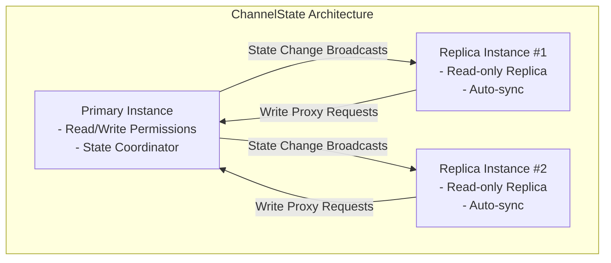

# ChannelState

ChannelState is a lightweight cross-context state management library built on the [BroadcastChannel API](https://developer.mozilla.org/en-US/docs/Web/API/BroadcastChannel), designed to provide efficient state synchronization across **same-origin** browser tabs, windows, and iframes.

```sh
npm install channelstate
```

## Key Features

- 🌐 Cross-context state synchronization (tabs/windows/iframes)
- ⚡ BroadcastChannel-based efficient communication
- 🧩 React Hooks integration (useChannelState)
- 🔒 Strong consistency guarantees (Primary-Replica protocol)
- 📦 Type-safe implementation (TypeScript first)

## Architectural Design

The `ChannelState` implements a `Primary-Replica` pattern with a single-writer/multiple-reader approach to ensure cross-context data consistency.



### Primary Instance

- Sole instance with direct write privileges
- Created via [createPrimaryChannelState](./src/channel/createPrimaryChannelState.ts)
- Responsibilities:
  - Process write proxy requests from replicas
  - Maintain authoritative state version
  - Broadcast state changes
  - Constraint: **Only one Primary instance allowed per channel**

### Replica Instance

- Created via [createReplicaChannelState](./src/channel/createReplicaChannelState.ts)
- Features:
  - Automatic synchronization with Primary instance
  - Write operations proxied through Primary
  - Supports unlimited replicas

> [!IMPORTANT]
> Critical Constraints
>
> 1. Channel Uniqueness: Single instance (Primary or Replica) per channelName per browser context
> 2. Primary Singleton: Multiple Primary instances in the same channel will break synchronization
> 3. Context Isolation: Each browser tab/window maintains independent instance topology

### API Style

The API style of `ChannelState` is similar to `Zustand` and provides React integration (`useChannelState`).

## Compatibility

`ChannelState` is compatible with modern browsers that support the [BroadcastChannel API](https://caniuse.com/?search=BroadcastChannel). This includes:

- Chrome 54+
- Firefox 38+
- Edge 79+
- Safari 15.4+
- Opera 41+
